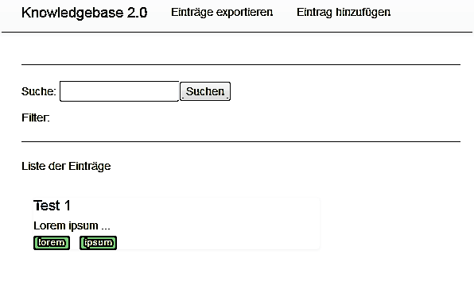
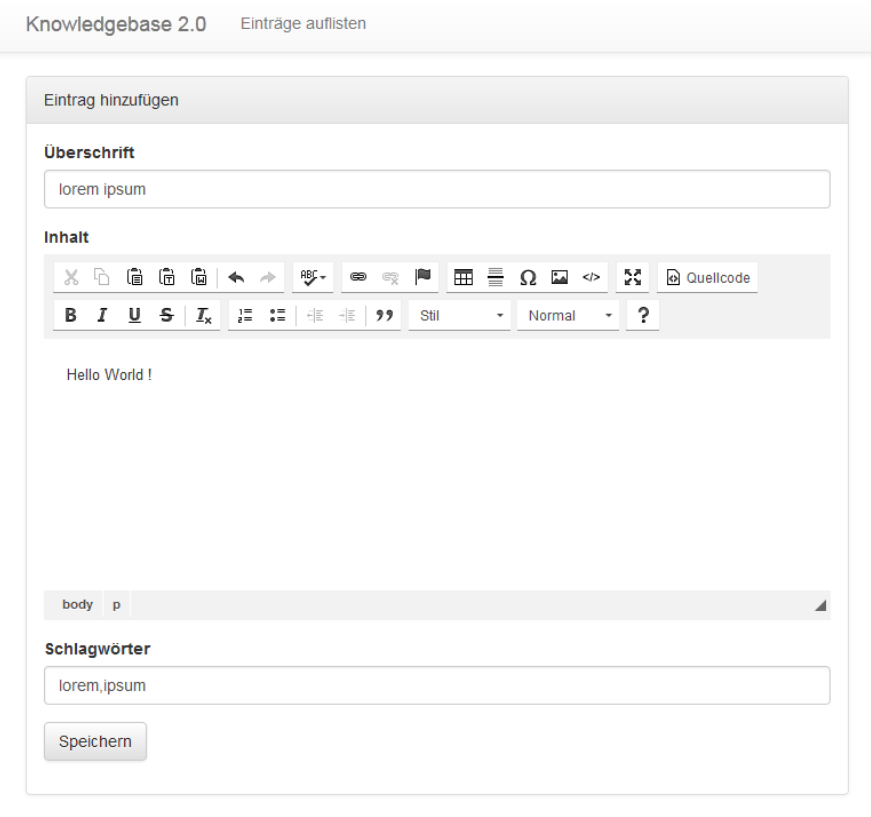
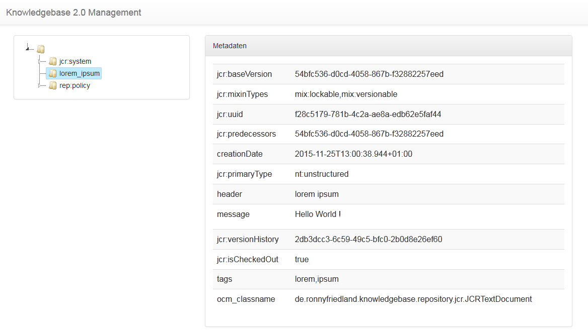

# Knowledgebase 2.0

Java based content store to store text-based information in a blog style.

## Features

* save text-based information
* possibility of tagging all entries
* paging support
* full text search with result highlighting
* XML export and import
  * response contains calculated sha-256 hash of xml data
* Windows application which can be accessed by taskbar icon
* REST interface to connect your custom frontend to the "Knowledgebase 2.0" backend
* SSL support for HTTP
* language support with message properties
* management view to browse the whole repository
* (symmetric) encryption support
* supports Maven and Gradle builds

## Requirements

* Java 7/8 JRE
* JCE Unlimited Strength Jurisdiction Policy Files
  * with current configuration using ssl, otherwise change ciphersuites and/or tls protocol version or disable ssl

## Screenshots

### List all entries

### Add a new entry

### Management view

## TODOs:

- unit testing (ongoing)

## Technology:

- Java SE 7
- Spring 4
- Apache Jackrabbit 2.10
- H2 Database
- Lucene Search
- Apache JCS 1.3
- JAX-RS
- Grizzly Http Server
- Freemarker 2.3
- jQuery JS
- JSTree
- Bootstrap CSS/JS
- Launch4j
- CKEditor 4
- BouncyCastle

## API:

| Context  | Description |
| ------------- | ------------- |
| /documents  | list view  |
| /documents/add  | add document  |
| /documents/{id}  | edit document with 'id'  |
| /documents/xml/import  | import xml view |
| /documents/xml/export  | export current (filtered) data as xml  |
| /documents/management  | management view  |

## Changelog:

### v0.1.11

- gradle build fixes
- add license

### v0.1.10

- introduce gradle build
- add custom error pages
- introduce symmetric encryption of content

### v0.1.9

- add basic auth support
- sorted taglist on top of list page

### v0.1.8

- add *nix start script
- some layout fix
- layout and translation fixes
- link management view
- layout fixes
- layout tag link
- code quality fixes
- add all tags on top of list view

### v0.1.7

- add managementview, list repository data, introduce jstree
- small refactorings regarding management view
- add bootstrap layout to metadata table
- fix missing translation, make management a template
- fix xml file import - add multipart enctype

### v0.1.6

- change maxlength from 50 to 100
- add language support for ckeditor plugin
- set encoding in xml outputstream
- remove trayicon on shutdown explicit
- remove content within index.html -> just redirect to list view
- fix: remove test tooltip

### v0.1.5

- update images (documentation)
- add search/tag filter to export filename
- change 'x' -> 'X'
- add language support (de|en)
- add "more" link translation
- fix encoding problem in propertyfile
- add english translation of import hint
- fix wrong message property

### v0.1.4

- fix ugly test code

### v0.1.3

- introduce mockito, add tests
- remove samples directory
- some refactoring in directory structure, add favicon to every page
- make interface configurable
- modify ckeditor toolbar
- possibility to embed existing documents (copy, no reference) - introduced new ckeditor-plugin
- update icon
- embeddocument plugin now adds '/raw' to the document link
- refactor exception handling - throw WebapplicationException instead of returning response

### v0.1.2

- raise grizzly version to fix welcomepage error
- update dependency versions to latest
- refactoring, fix code duplications
- fix use of deprecated constructor
- refactor xml export/import
- fix path annotations
- update plugin versions
- fix assembly
- introduce ssl encryption for http listener
- fix keystore loading
- minor refactoring

### v0.1.1

- fix layout header in modal div
- add close button
- fix id for modal div
- use grizzly instead of sparkjava, introduce jax-rs, some refactorings

